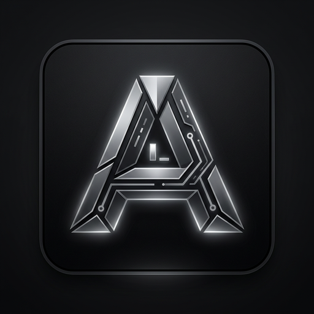

# ARC — AI-Native Terminal & Agent Runtime

<div align="center">
  
</div>

[](LICENSE)
[](https://github.com/anthropics/arc)

**ARC** is a powerful desktop terminal and AI agent runtime built with Tauri (Rust) and React (TypeScript). It unifies a real PTY-backed terminal, embedded code editor, multi-tab workspace management, AI chat with tool-using agents, and local + cloud AI providers into a single, cohesive developer interface.

## What is ARC?

**Core features:**
- **Real PTY Terminal** — xterm.js frontend backed by portable-pty, supporting bash, zsh, PowerShell, cmd, Nu, WSL, and custom shells
- **Code Editor** — CodeMirror 6 with syntax highlighting, git-aware features, and real-time file watching
- **AI Chat** — Stream from OpenAI, Anthropic (Claude), or local Ollama models with customizable agent personas
- **Autonomous Agents** — Run `/agent <goal>` to spawn a tool-using AI agent that reads files, searches code, runs shell commands, and edits files—all with your explicit approval
- **Model Context Protocol (MCP)** — Connect MCP servers to extend agents with third-party tools (web search, databases, APIs, etc.)
- **Persistent Memory** — Workspace-scoped notes with dual search: keyword-based full-text (FTS5) and semantic (vector embeddings)
- **Git Integration** — View branch status, diffs, logs, blame, and more directly from the UI without terminal commands
- **File Search & Indexing** — BM25 full-text search with tantivy indexing for fast codebase exploration

## Quick Start

### Desktop App (Tauri)

```bash
# Prerequisites: Node 20+, pnpm 9.x, Rust 1.80+
# See INSTALLATION.md for full setup

git clone https://github.com/anthropics/arc.git
cd arc

pnpm install                 # Install JS dependencies
pnpm tauri:dev               # Boot the app (Vite + Rust shell)
```

The Tauri window opens at `1280x820` with the terminal, editor, and file tree ready to use.

### Frontend Only (Browser, No Terminal)

To develop the UI in isolation without Rust dependencies:

```bash
pnpm dev                     # Open http://127.0.0.1:5173
```

**Limitations:** PTY, filesystem, and LLM features are stubbed (chat echoes locally).

## Documentation

**Start here:** [INSTALLATION.md](INSTALLATION.md) for setup, then choose your path below.

### 📖 For New Users

| Document | Purpose |
|----------|---------|
| **[INSTALLATION.md](INSTALLATION.md)** | Setup on macOS/Windows/Linux, configure AI providers, set default shell |
| **[FEATURES.md](FEATURES.md)** | Step-by-step guides for Terminal, Editor, Chat, Agents, Memory, Settings |
| **[FAQ_AND_TROUBLESHOOTING.md](FAQ_AND_TROUBLESHOOTING.md)** | Common questions, performance tips, error fixes |
| **[GLOSSARY.md](GLOSSARY.md)** | Definitions (MCP, agent, PTY, approval, Zustand, etc.) |

### 👨‍💻 For Developers & Contributors

| Document | Purpose |
|----------|---------|
| **[DEVELOPMENT.md](DEVELOPMENT.md)** | Local dev setup, code conventions, adding Tauri commands, React components, Rust crates |
| **[ARCHITECTURE.md](ARCHITECTURE.md)** | System design, IPC contract, all 57+ Tauri commands, data flow diagrams |
| **[API_REFERENCE.md](API_REFERENCE.md)** | Complete Tauri command signatures, parameters, return types, errors, examples |
| **[CONTRIBUTING.md](CONTRIBUTING.md)** | PR process, commit messages, areas needing help, licensing |

### 🤖 For Agents & AI Integration

| Document | Purpose |
|----------|---------|
| **[AGENTS.md](AGENTS.md)** | How agents work, built-in tools, approval gating, agent personas, custom agents |
| **[MCP_INTEGRATION.md](MCP_INTEGRATION.md)** | Building MCP servers, connecting to ARC, tool/resource definitions, examples |
| **[SECURITY.md](SECURITY.md)** | Credential vault, approval security, best practices, incident response |

### 🏗️ For Deep Dives

| Document | Purpose |
|----------|---------|
| **[docs/architecture.md](docs/architecture.md)** | Layered design, component communication, Zustand stores, SQLite schema |
| **[docs/decisions.md](docs/decisions.md)** | Why Tauri/Rust/Zustand, crate split, tradeoffs (architecture decision records) |
| **[CLAUDE.md](CLAUDE.md)** | Orientation for Claude Code editing this repository |
| **[PLANNED_FEATURES.md](PLANNED_FEATURES.md)** | Roadmap: Git UI, test integration, database browser, split panes, plugins |

### 📚 Rust Crate Documentation

- **[rust/pty/](rust/pty/)** — PTY spawning, resizing, I/O via portable-pty
- **[rust/ai-runtime/](rust/ai-runtime/)** — Streaming LLM providers (OpenAI, Anthropic, Ollama)
- **[rust/filesystem/](rust/filesystem/)** — File ops, watching, tantivy search, indexing
- **[rust/git/](rust/git/)** — Git status/log/diff/blame via CLI
- **[rust/session-manager/](rust/session-manager/)** — SQLite persistence (workspace, chat, memory)
- **[rust/agent-runtime/](rust/agent-runtime/)** — Tool-using agent loop, approval gating

## Tech Stack

**Frontend:** 
- React 18 + Vite + TypeScript
- State: Zustand (workspace, chat, settings, files stores)
- Editor: CodeMirror 6 (lazy-loaded language support)
- Terminal: xterm.js (PTY-backed)
- Styling: Tailwind CSS (dark-first, Catppuccin Mocha palette)
- Testing: Vitest (unit tests)

**Desktop Shell:**
- Tauri 2 (app framework, native system access)
- IPC via invoke/listen (typed wrappers in `lib/tauri.ts`)
- WebView2 (Windows), WebKit2GTK (Linux), WKWebView (macOS)

**Backend (Rust 1.80+):**
- `arc-pty` — PTY process spawning/resize/kill (portable-pty, tokio)
- `arc-ai-runtime` — Streaming LLM providers: OpenAI, Anthropic, Ollama (reqwest, eventsource, serde)
- `arc-session-manager` — SQLite persistence: workspaces, tabs, chat, commands, memory, agent runs (sqlx, sqlx-sqlite)
- `arc-agent-runtime` — Tool-using coding agent with approval gating, built-in tools, MCP bridge (anthropic SDK)
- `arc-filesystem` — File ops, watching, BM25 search, indexing (notify, tantivy, serde)
- `arc-git` — Git introspection via CLI (porcelain output parsing)

**Database & Search:**
- SQLite 3 (bundled, ~50 MiB database at `<data_dir>/arc/arc.db`)
- tantivy 0.22 (BM25 full-text search, FTS5 fallback, index at `<data_dir>/arc/index/`)
- SQLx (async, compile-time verified SQL queries)

**Credentials & Secrets:**
- OS credential vault: Keychain (macOS), Credential Manager (Windows), secret-service (Linux)
- `keyring` crate for vault integration
- API keys never persisted to disk

**Workspace Structure:**
```
apps/frontend/        React UI (Vite, TypeScript)
apps/desktop/         Tauri shell (Rust, CLI commands)
packages/             Shared TS packages (types, providers, UI tokens)
rust/                 Cargo workspace (pty, ai-runtime, session-manager, etc.)
docs/                 Architecture guides, decision records
```

## Platform Support

| Platform | Status | Notes |
|----------|--------|-------|
| **macOS** | ✅ Tested | 12+ (x86_64 + Apple Silicon) |
| **Windows** | ✅ Tested | 10+ (WebView2 required) |
| **Linux** | ✅ Tested | gtk3 (WebKit2GTK) required |

## Roadmap

ARC is in **Phase 1** with core features shipped (terminal, editor, chat, agent, memory, git, search). Future phases include:

| Phase | Timeline | Highlights |
|-------|----------|-----------|
| **Phase 1** ✅ | Now | PTY terminal, editor, AI chat, agents, MCP, memory, git, file search |
| **Phase 2** 🟡 | Weeks 1-6 | Git UI (branches/stash), test integration, environment manager, database browser |
| **Phase 3** 🟡 | Weeks 6-8 | SQLite explorer, external DB support via MCP, query builder |
| **Phase 4** 🟡 | Weeks 8-12 | Custom agent templates, code review agent, docs generator, perf analyzer |
| **Phase 5** 🟡 | Weeks 6-10 | Split pane layout, workspace snapshots, UI polish |
| **Phase 6** 🟡 | Weeks 8-12 | Terminal recording/replay, quick actions palette (⌘K), dependency scanner |
| **Phase 7** 🟡 | Weeks 10-14 | Dependency graph, vulnerability scanning, accessibility |
| **Phase 8** 🟡 | Weeks 12+ | Workspace sharing, cloud sync, real-time collaboration |

See [PLANNED_FEATURES.md](PLANNED_FEATURES.md) for detailed specs, implementation notes, and prioritization.

## Contributing

We welcome contributions! Please read [CONTRIBUTING.md](CONTRIBUTING.md) for:
- Setting up your development environment
- Code conventions and style
- Commit message format
- Pull request process
- Areas where we need help (testing, docs, bugs, performance, MCP integrations)

**Quick checklist before submitting a PR:**

```bash
pnpm typecheck               # Type-check all TypeScript
cargo check --workspace      # Check all Rust crates
pnpm lint && pnpm format     # Lint and format code
pnpm tauri:dev               # Test the app manually
```

For the reasoning behind architectural decisions, see [docs/decisions.md](docs/decisions.md).

## License

ARC is licensed under the [MIT License](LICENSE), which permits:
- ✅ Commercial use
- ✅ Modification and distribution
- ✅ Private use

See [LICENSE](LICENSE) for full details.

## Help & Questions

- **Setup issues?** → [INSTALLATION.md](INSTALLATION.md#troubleshooting)
- **How do I use ARC?** → [FEATURES.md](FEATURES.md)
- **Common questions?** → [FAQ_AND_TROUBLESHOOTING.md](FAQ_AND_TROUBLESHOOTING.md)
- **How does it work?** → [ARCHITECTURE.md](ARCHITECTURE.md)
- **Want to contribute?** → [DEVELOPMENT.md](DEVELOPMENT.md) + [CONTRIBUTING.md](CONTRIBUTING.md)
- **Security questions?** → [SECURITY.md](SECURITY.md)
- **Building MCP servers?** → [MCP_INTEGRATION.md](MCP_INTEGRATION.md)
- **Using agents?** → [AGENTS.md](AGENTS.md)
- **Editing this repo in Claude Code?** → [CLAUDE.md](CLAUDE.md)